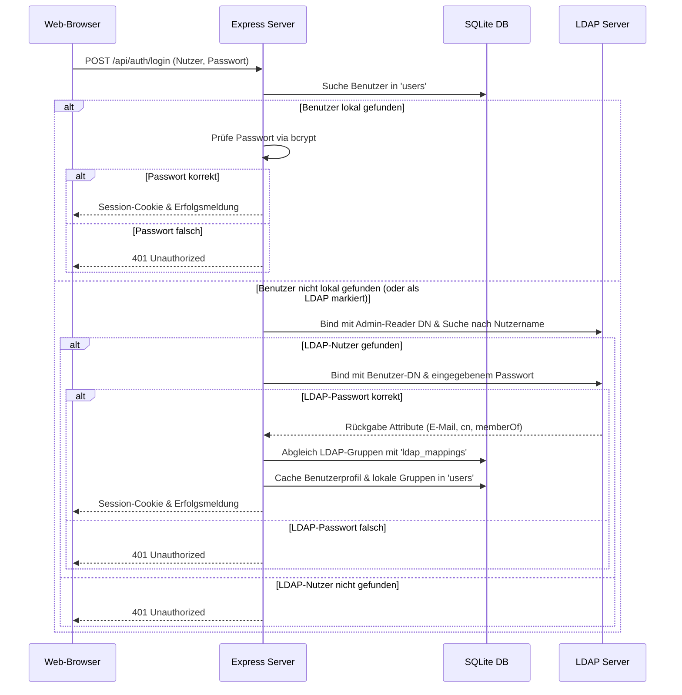

# MSO Cloud Launcher & Lobby - Systemdokumentation

Dieses Dokument dokumentiert die Architektur, die Funktionsweise und das Zusammenspiel der Komponenten des modernisierten MSO Cloud Launchers.

---

## 1. Systemarchitektur & Ablaufpläne

Das System ist als **Node.js-Monolith** auf Basis von **Express** und einer eingebetteten **SQLite-Datenbank** aufgebaut. Die Struktur gewährleistet extrem schnelle Antwortzeiten, ein vereinfachtes Deployment (Single-Instance) und eine vollständige Abkoppelung von externen Diensten im Offline-Fall.

### A. Erstinstallation (Wizard)
1. Die Server-Middleware (`src/server.js`) prüft bei jedem HTTP-Request den Wert `setup_completed` in der Tabelle `config`.
2. Ist dieser Wert nicht `'1'`, werden sämtliche Anfragen (außer statische CSS/JS-Dateien und die Setup-API) automatisch auf `/setup.html` umgeleitet.
3. Der Installations-Assistent (`public/setup.html`) führt den Administrator durch die Anlage des ersten Admin-Kontos.
4. Nach dem Speichern wird `setup_completed` auf `'1'` gesetzt, die Datenbank-Struktur initialisiert und vier Beispiel-Kacheln erstellt.

### B. Duales Anmeldeverfahren (Lokale DB & LDAP)

---

## 2. API-Endpunkte & Berechtigungen

### Authentifizierung & Konten (`/api/auth`)
* `GET /me`: Gibt die Profildaten des aktuell angemeldeten Benutzers zurück.
* `POST /login`: Führt das duale Anmeldeverfahren aus.
* `POST /logout`: Zerstört die Express-Session und löscht das Cookie.
* `POST /reset-request`: Generiert ein zeitlich begrenztes Reset-Token für lokale Accounts und versendet eine E-Mail per SMTP.
* `POST /reset-password`: Setzt das Passwort für den Token-Inhaber neu.

### Kacheln & SSO (`/api/tiles`)
* `GET /`: Gibt alle für die Berechtigungsstufe des Nutzers freigegebenen Kacheln zurück.
* `GET /sso/:id`: Authentifizierungs-Gateway. Validiert den Zugriff und führt optional ein SSO-Signing durch:
  * **Typ 'query'**: Appends `sso_user`, `sso_email`, `sso_time` und eine kryptographische HMAC-SHA256 Signatur `sso_sig`.
  * **Typ 'jwt'**: Generiert ein symmetrisch signiertes JSON Web Token mit 1 Minute Gültigkeit und hängt `sso_token` an.

### Administration (`/api/admin`) – *Nur für Rolle 'admin'*
* `GET/POST /config`: Verwaltet LDAP- und SMTP-Verbindungsparameter.
* `POST /config/test-ldap`: Testet die Active-Directory Anbindung live.
* `POST /config/test-smtp`: Verifiziert den Mailserver-Versand.
* `GET/POST/PUT/DELETE /tiles`: Verwaltet das Angebot an Kacheln im Portal.
* `GET/POST/DELETE /ldap-mappings`: Richtet Zuordnungsregeln für LDAP-Sicherheitsgruppen ein.
* `GET/POST/PUT/DELETE /users`: Verwaltet Benutzerkonten.
* `POST /system/update`: Triggert den asynchronen GitHub Auto-Updater.

---

## 3. GitHub-Updater & PM2-Bereitstellung

### Der Update-Workflow (`src/updater.js`)
Der Updater ermöglicht ein automatisiertes "One-Click-Update" direkt aus der Administration:
1. **GitHub Pull**: Führt `git pull` aus.
2. **NPM-Update**: Installiert eventuell hinzugefügte Module (`npm install`).
3. **Datenbank-Migration**: Führt das Migrationsskript aus, welches neue `.sql`-Dateien in `/migrations` aufspürt und transaktionsgesichert importiert.
4. **PM2 Reload**: Führt `pm2 reload mso-cloud` aus, um den Prozess im Hintergrund ohne Verbindungsunterbrechung neu zu laden.

### PM2 Ecosystem Konfiguration (`ecosystem.config.js`)
Die Anwendung ist für den stabilen Dauerbetrieb konfiguriert:
* **Modus**: `fork` (verhindert Sperrkonflikte bei gleichzeitigem Schreiben auf die SQLite-Datei).
* **Automatisches Memory-Limit**: Startet die Instanz ab einem Verbrauch von `300MB` automatisch neu.
* **Auto-Start**: Startet bei Systemneustarts automatisch.

---

## 4. Premium-Design-Tokens (CSS)

Die Benutzeroberfläche nutzt ein maßgeschneidertes **Glassmorphic-Konzept** auf HSL-Basis:
* **Blur**: `backdrop-filter: blur(14px)` erzeugt den matten Milchglaseffekt.
* **Akzentfarben**:
  * Neon-Blau (`#2e8bfa`) als Hauptakzent.
  * Status Grün (`#4ade80`) signalisiert aktive, geprüfte Dienste.
  * Status Rot (`#f87171`) signalisiert Ausfälle.
* **Micro-Animations**:
  * Smooth Hover: `transform: translateY(-8px)` mit `cubic-bezier(0.16, 1, 0.3, 1)`.
  * Pulsierende Online-Indikatoren über `@keyframes pulse`.
